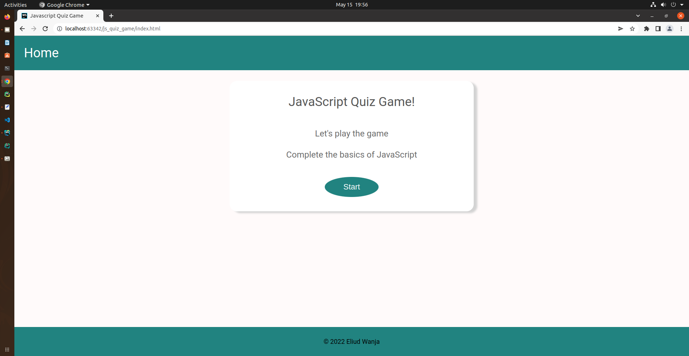

<h3> js_quiz_game </h3>
<h4>By Eliud Wanja</h4>

<h3>Table of Content</h3>

- [Description](#description)
- [Features](#features)
- [Behaviour Driven Development](#Behaviour-Driven-Development)
- [Requirements](#requirements)
- [Installation Process](#installation-Process)
- [Live Link](#Live-Link)
- [Technology  Used](#technology-Used)
- [Licence](#licence)
- [Authors Info](#Authors-Info)

### Description

An interactive, JavaScript quiz game that a user has multi-choice questions when the website loads: and allows 
user to select the correct answer for the given question

### [Features](#features)

As a user of the web page, you will be able to:

1. See multiple questions when the page loads.
2. Answer question and get feedback.
3. See the results after the game.

### [Requirements](#requirements)

* Access to a computer or an electronic device
* Access to stable internet

### [Installation Process](#installation-Process)

* Clone to this repo : git@github.com:eliudkw/js_quiz_game.git
* Unzip the downloaded files in a folder of choice.
* Open the index file from the zipped file with any browser.

 ****

### [Live Link](#Live-Link)

- Click the live link at the about section in the main branch or direct link below  

### [Technology  Used](#technology-Used)

* HTML - to develop the structure of the pages.
* CSS - to style the User Interface.
* JavaScript - for interactivity.
* JQuery - to manipulate the DOM.

#### Licence

MIT License
Copyright (c) [2022] [Eliud Wanja]
Permission is hereby granted, free of charge, to any person obtaining a copy
of this web page and associated documentation files, to deal
in the web page without restriction, including without limitation the rights
to use, copy, modify, merge, publish, distribute, sublicense, and/or sell
copies of the webpage, and to permit persons to whom the webpage is
furnished to do so, subject to the following conditions:

THE WEBPAGE IS PROVIDED "AS IS", WITHOUT WARRANTY OF ANY KIND, EXPRESS OR
IMPLIED, INCLUDING BUT NOT LIMITED TO THE WARRANTIES OF MERCHANTABILITY,
FITNESS FOR A PARTICULAR PURPOSE AND NONINFRINGEMENT. IN NO EVENT SHALL THE
AUTHORS OR COPYRIGHT HOLDERS BE LIABLE FOR ANY CLAIM, DAMAGES OR OTHER
LIABILITY, WHETHER IN AN ACTION OF CONTRACT, TORT OR OTHERWISE, ARISING FROM,
OUT OF OR IN CONNECTION WITH THE WEBPAGE OR THE USE OR OTHER DEALINGS IN THE
WEBPAGE

### [Authors Info](#Authors-Info)

Linked - [Eliud Wanja](https://www.linkedin.com/in/eliud-wanja)
)

